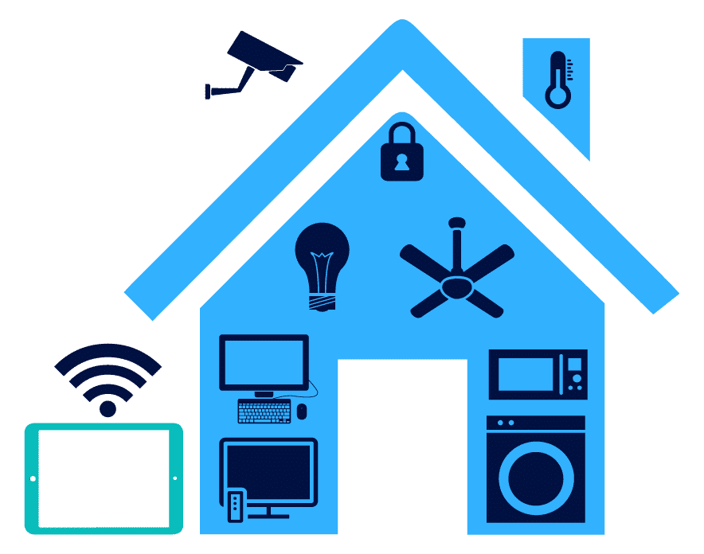
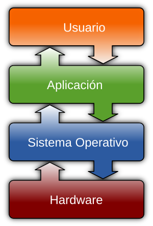

# UT1: Construyendo los cimientos

## 1. ¿Qué es un ordenador?

¿Piensas que un ordenador es solo el PC que usas en clase o el portátil de casa? En realidad, los llevamos en el bolsillo y los usamos sin darnos cuenta a cada momento. Son el corazón de nuestros teléfonos móviles, las consolas con las que jugamos, los coches actuales que nos transportan e incluso algunos electrodomésticos de nuestra cocina.

{width=50%}

La clave para entender por qué un teléfono, una consola o un coche son, en esencia, ordenadores, es que todos comparten la misma arquitectura funcional. A pesar de sus diferencias externas, cada uno de ellos:

- Procesan información: Posee un núcleo o **procesador** encargado de ejecutar instrucciones de un determinado **programa** y tomar decisiones basadas en esa información.

- Los datos que procesan son almacenados en **memoria temporal (RAM)** o en **memoria permanente (disco duro HD o SSD)**

- Interactúa con el exterior: Utiliza **dispositivos de entrada** para recibir datos (como la pantalla táctil de un móvil o un sensor de temperatura en un horno) y **dispositivos de salida** para actuar (como la pantalla misma, un motor o un altavoz).

Este ciclo de recibir datos, procesarlos siguiendo un programa y generar un resultado es el principio fundamental que todos estos sistemas informáticos tienen en común.

!!! info "Componente básicos de un sistema informático"

    En este punto, podemos decir que un ordenador o mejor dicho, un sistema informático, es un conjunto de componentes que trabajan juntos para procesar información. Estos componentes podemos dividirlos en: 

    - **Hardware** son los componentes físicos del sistema informático, como la CPU, la memoria RAM, el disco duro, la placa base, etc.
    - **Software** son los programas y aplicaciones que se ejecutan en el hardware, como el sistema operativo, los navegadores web, los juegos, etc.

En el siguiente gráfico se representa la relación entre los diferentes componentes de un sistema informatico.
{width=40%, align=right}

Los usuarios interactúan con el sistema por medio de las aplicaciones que utilizan, como un navegador web o un juego. Estas aplicaciones se ejecutan sobre un sistema operativo concreto, que es el software que gestiona el hardware. Hasta tal punto existe la dependencia de las aplicaciones con el sistema operativo, que cada sistema operativo tiene sus propias aplicaciones diseñadas específicamente para él. Por ejemplo, las aplicaciones de Windows no funcionan en MacOS, ni tampoco las de Android en iOS. 

Igualmente, el sistema operativo se ejecuta sobre un hardware concreto. No se puede ejecutar un sistema operativo MacOS en un ordenador PC con Windows,ya que ambos están diseñados para arquitecturas de hardware diferentes.

!!! question "AC1.1 Componentes de un sistema informático."

    Como hemos visto, a pesar de que todos estos dispositivos son diferentes, todos comparten una estructura básica común que les permite funcionar.

    **1.** Haciendo uso del siguiente enlace, [Informática, Hardware y Software](https://youtu.be/gVaE2F0jOJs?si=dTaipLuWbjBVsqgy), completa en tu cuaderno la siguiente tabla:
    
  
    ```mermaid

    flowchart TD

    subgraph subGraph["Sistema Informático"]
        A["Componentes de un Ordenador"]
    end

    A --> B("&nbsp &nbsp &nbsp &nbsp &nbsp &nbsp &nbsp &nbsp") & C("Software")
    B --> B1("Componentes Internos") & B2("&nbsp &nbsp &nbsp &nbsp &nbsp &nbsp &nbsp &nbsp")
    B1 --> n4["&nbsp &nbsp &nbsp &nbsp &nbsp &nbsp &nbsp &nbsp"] & n5["&nbsp &nbsp &nbsp &nbsp &nbsp &nbsp &nbsp &nbsp"]
    B2 --> n6["&nbsp &nbsp &nbsp &nbsp &nbsp &nbsp &nbsp &nbsp"] & n7["&nbsp &nbsp &nbsp &nbsp &nbsp &nbsp &nbsp &nbsp"]
    C --> n8["&nbsp &nbsp &nbsp &nbsp &nbsp &nbsp &nbsp &nbsp"] & n9["&nbsp &nbsp &nbsp &nbsp &nbsp &nbsp &nbsp &nbsp"]
    ```

    **2.** Pon ejemplo de cada uno de los componentes finales del diagrama anterior tomando como ejemplo el ordenador de clase y cualquier otro dispositivo que tengas en casa, por ejemplo, el teléfono móvil, tablet o la consola de videojuegos.


## 2. Lenguajes de programación ¿qué son y para qué sirven?

Ya sabemos que el hardware necesita del software, programas, para funcionar. Pero, ¿cómo se crean esos programas? Aquí es donde entran en juego los **lenguajes de programación**.

Los lenguajes de programación son herramientas que permiten a los desarrolladores escribir instrucciones que el ordenador puede entender y ejecutar. Estas instrucciones son lo que llamamos **código**. Al igual que los humanos hablamos diferentes idiomas (español, inglés, francés...), existen infinidad de lenguajes de programación, cada uno con sus propias reglas y sintaxis.

Antes de analizar los lenguajes de programación, es importante entender cómo los ordenadores codifican la información.

### 2.1 ¿Cómo codifican los ordenadores la información?

Los computadores a diferencia de los humanos, codifican toda la información con dos dígitos: el 0 y el 1. Estos dígitos forman lo que se conoce como ***código binario***, que es el lenguaje que entienden los ordenadores. Cada 0 o 1 se llama ***bit***, que es la unidad más pequeña de información en un ordenador. Las computadoras de hoy utilizan miles de millones de bits para realizar cálculos y almacenar información. 

| Nombre             | Descripción                                                                                                                                           | Valor              |
|--------------------|-------------------------------------------------------------------------------------------------------------------------------------------------------|--------------------|
| Bit                | Un bit contiene un valor digital. En el dispositivo, el valor representa una posición de interruptor de Encendido o Desactivado.                      | 0 o 1              |
| Byte               | Los bits generalmente se combinan en un grupo de 8. Este grupo se denomina byte. Un byte contiene una pequeña cantidad de información, como una letra. | 8 bits             |
| Kilobyte           | Un kilobyte contiene 2<sup>10</sup> bits. Es lo suficientemente grande como para almacenar unas pocas líneas de texto.                                 | 1.024 bytes        |
| Megabyte           | Un megabyte contiene 2<sup>20</sup> bits. Es lo suficientemente grande como para almacenar aproximadamente un minuto de música.                        | 1.048.576 bytes    |
| Gigabyte           | Un gigabyte contiene 2<sup>30</sup> bits. Es lo suficientemente grande como para almacenar unos tres minutos de vídeo.                                 | 1.073.741.824 bytes|
| Unidades más grandes| Más allá de los gigabytes, puede medir datos en unidades de terabytes, petabytes, exabytes, zettabytes y yottabytes.                                 |                    |

Por tanto, toda la información que procesa un ordenador, desde los números que ves en una hoja de cálculo hasta las imágenes y sonidos que escuchas en un videojuego, son secuencias de 0s y 1s. Por ejemplo, la letra "A" en código binario es 01000001, que es cómo el ordenador la entiende. Incluso las instrucciones que ejecuta un ordenador, como sumar dos números o mostrar un mensaje en pantalla, están codificadas en este lenguaje binario.

### 2.2 Tipos de lenguajes de programación


## 3. Python

## 4. Motores de Juego

### 4.1 Godot y GDScript

## 5. Primeros pasos con GDScript

### 5.1 Valores, variables y tipos de datos

### 5.2 Constantes

### 5.3 Operadores y expresiones


## Referencias

    Componentes básicos de un sistema informático:

        ¿Qué es un sistema informático? (para niños) - Enciclopedia Kiddle: Utiliza un lenguaje muy sencillo y analogías para explicar qué es el hardware, el software y su interrelación. Perfecto como punto de partida.

        Sistemas informáticos: Definición y componentes - Educatica: Un poco más detallado pero todavía muy claro. Sirve para afianzar los conceptos de entrada, procesamiento y salida.

    Lenguajes de programación, Python y Motores de Juego:

        ¿Qué es un lenguaje de programación? - AWS (Amazon Web Services): Aunque el artículo es sobre Python, la introducción explica de forma muy clara y general qué es un lenguaje de programación, su tipología y por qué son necesarios.

        ¿Qué es un motor de videojuegos? (para niños) - Enciclopedia Kiddle: La mejor explicación para este nivel. Usa la analogía de una "caja de herramientas" que los alumnos entenderán al instante.

    Godot y GDScript (la base práctica):

        Documentación Oficial de Godot (Primeros pasos) - Godot Docs: La documentación oficial es excelente. Esta sección es perfecta para que empiecen a familiarizarse con el entorno de forma guiada. Recomiendo especialmente el apartado "Aprende a programar con GDScript".

        Referencia de GDScript (Básicos) - Godot Docs: Esta página es ideal para tenerla como referencia constante mientras explicas las variables, tipos de datos, constantes, operadores y expresiones. Es el "libro de consulta" oficial.

Criterios de Evaluación Implicados (Competencia Específica 2)

Para este "Tema 1", al ser introductorio y centrado en los fundamentos, las actividades que desarrolles (explicaciones, pequeños ejercicios prácticos, resolución de dudas) trabajarán principalmente los siguientes criterios de evaluación de 2º curso:

    2.1. Analizar problemas elementales significativos para el alumnado, mediante la abstracción y modelización de la realidad.

        Justificación: Cuando expliques las variables y los tipos de datos, estarás enseñándoles a modelizar la realidad. Por ejemplo, la "puntuación" de un juego se convierte en una variable de tipo entero (int), y el "nombre del jugador" en una de tipo texto (String). Este es el primer paso de la abstracción.

    2.3. Resolver de forma guiada problemas elementales utilizando los algoritmos y las estructuras de datos necesarias.

        Justificación: Cualquier pequeño ejercicio práctico que propongas, como "crea una variable para guardar la vida de un personaje y otra para el daño de un ataque, y calcula la vida restante usando operadores", es una forma de resolver un problema elemental de forma guiada, utilizando las estructuras de datos más básicas (las variables).

    2.4. Programar aplicaciones sencillas de forma guiada para resolver problemas elementales.

        Justificación: Aunque no creen una aplicación completa, escribir las primeras líneas de código en GDScript para declarar variables, asignar valores y operar con ellas, se considera una iniciación a la programación de aplicaciones sencillas y guiadas para resolver micro-problemas (como calcular una suma o concatenar un texto).

El criterio 2.2 (Analizar y validar aplicaciones informáticas existentes) se tocará de forma tangencial cuando les muestres ejemplos de código para explicar los conceptos, ya que estarán analizando un código que ya funciona.

- [IBM Open e-Learning Ecosystem - Computer Basics](https://ole03.yourlearning.ibm.com/mod/scorm/player.php?a=494&currentorg=articulate_rise&scoid=2397&display=popup&mode=normal&lang=en)